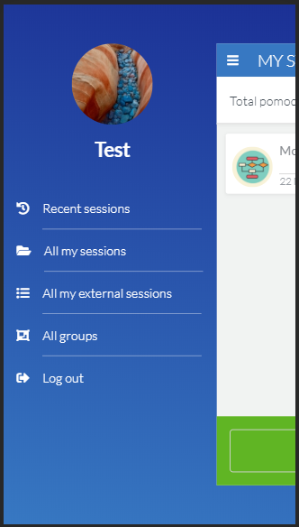
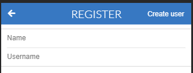
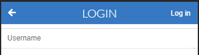
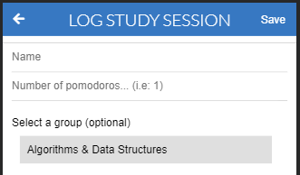
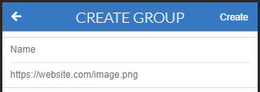

# Learning Tracker

> This is a learning tracker application which lets the user register learning sessions in terms of number of Pomodoros per session. Sessions can also be included in groups when created, and new groups can be created as well.

## Built With

- Ruby: 2.7.0
- Rails: 6.0.2

## Live Demo

- Go to https://learning-tracker-ror.herokuapp.com/ to see the live version.
- Log in with the user "testuser" to test the app.

## Video Demo

- [View video here](https://www.loom.com/share/bc206bc7edac479fb3087e98965aba1e)

## Screenshot



## Features

- A user can be created and logged in.
- Sessions can be created by each user and group them into a specific category.
- They can create new groups or use existing groups.
- The user can see a list of grouped sessions in "All my sessions".
- The user can see a list of ungrouped sessions under "All my external sessions".
- The user can access all existing groups and see the sessions that belong to that group, together with the author name, by clicking "All groups".
- The user can see a list of their 5 most recently created sessions and a total of pomodoros for those sessions, and see if they are grouped or ungrupped under "Recent sessions".

## Usage

Signing up:
1. Got to the [homepage](https://learning-tracker-ror.herokuapp.com/)
2. Click "Register".
3. Enter a name and username, then Click "Create user" (top-right corner).

    

Logging in:
1. Got to the [homepage](https://learning-tracker-ror.herokuapp.com/)
2. Click "Login".
3. Enter the username previously created.

    

Logging a new study session:
1. Click the "Add new" button from "All my sessions", "All my external sessions", or after clicking into a group page.
2. Enter a name, the number of pomodoros for the session, and optionally, select a group to categorize the session.
3. Click "Save" (top-right corner).

    

Creating a new group:
1. Click "All groups" from the main profile page.
2. Go to "Create new" at the bottom.
3. Enter a name for the group, and optionally enter an image url (ending with png, jpg, jpeg, or gif). If no image url is provided a random image will show up for the group.
4. Click "Create".

    

## Getting Started

To get a local copy up and running follow these simple example steps.

### Prerequisites

- Ruby: 2.6.3
- Rails: 5.2.3
- Postgres: >=9.5

### Setup

Download or clone this repo and cd into it.

Instal gems with:

```
bundle install
```

Install postgresql on your machine and [set up a user](https://www.ionos.com/community/hosting/postgresql/how-to-use-postgresql-with-your-ruby-on-rails-application-on-ubuntu-1604/) before the next steps.

Setup database with:

```
rails db:create
rails db:migrate
```


### Usage

Start server with:

```
rails server
```

Open `http://localhost:3000/` in your browser.

### Run tests

```
rpsec
```


## Authors

👤 **Sebastian Gil Rodriguez**

- Github: [@sebGilR](https://github.com/sebGilR)
- Twitter: [@sebGilR](https://twitter.com/sebGilR)
- Linkedin: [sebastiangilrodriguez](https://www.linkedin.com/in/sebastiangilrodriguez)

## 🤝 Contributing

Contributions, issues and feature requests are welcome!

Feel free to check the [issues page](issues/).

## Show your support

Give a ⭐️ if you like this project!

## Acknowledgements

Design idea by [Gregoire Vella on Behance](https://www.behance.net/gregoirevella).