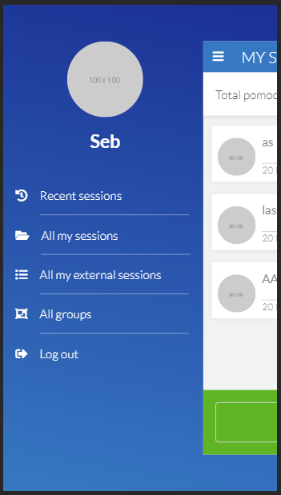

# Learning Tracker

> This is a learning tracker application which lets the user register learning sessions in terms of number of Pomodoros per session. Sessions can also be included in groups when created, and new groups can be created as well.

## Built With

Ruby: 2.7.0
Rails: 6.0.2

## Live Demo

Go to https://social-media-ror.herokuapp.com/ to see the live version.

## Screenshot




## Getting Started

To get a local copy up and running follow these simple example steps.

### Prerequisites

Ruby: 2.6.3
Rails: 5.2.3
Postgres: >=9.5

### Setup

Download or clone this repo and cd into it.

Instal gems with:

```
bundle install
```

Setup database with:

```
   rails db:create
   rails db:migrate
```


### Usage

Start server with:

```
    rails server
```

Open `http://localhost:3000/` in your browser.

### Run tests

```
    rpsec
```


## Authors

👤 **Sebastian Gil Rodriguez**

- Github: [@sebGilR](https://github.com/sebGilR)
- Twitter: [@sebGilR](https://twitter.com/sebGilR)
- Linkedin: [sebastiangilrodriguez](https://www.linkedin.com/in/sebastiangilrodriguez)

## 🤝 Contributing

Contributions, issues and feature requests are welcome!

Feel free to check the [issues page](issues/).

## Show your support

Give a ⭐️ if you like this project!
